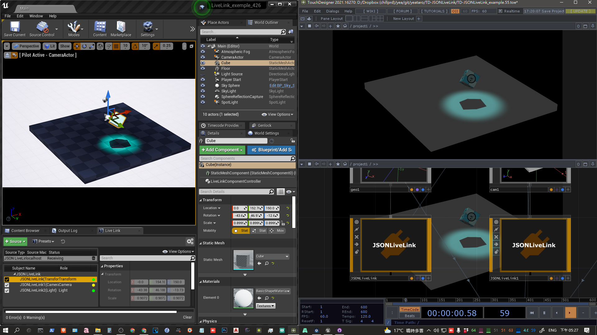
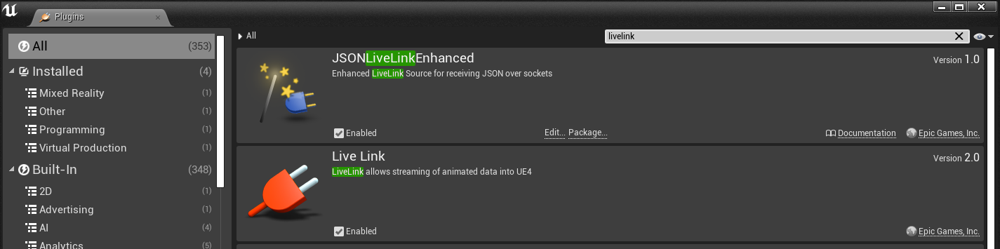
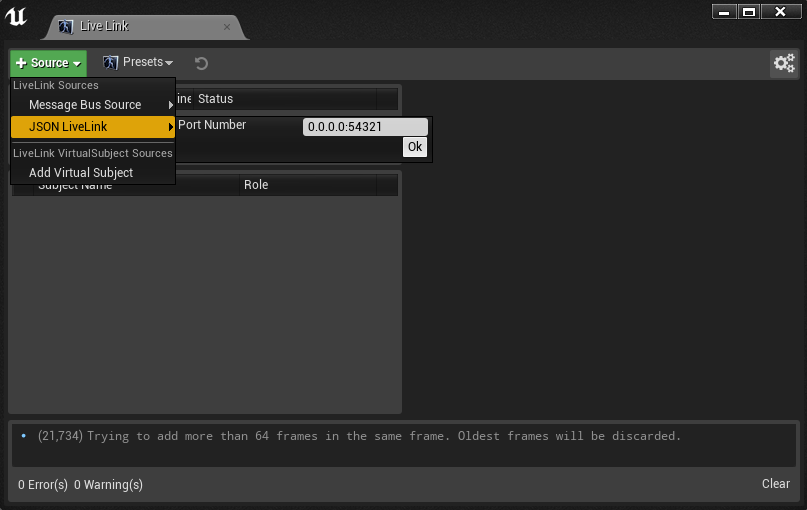
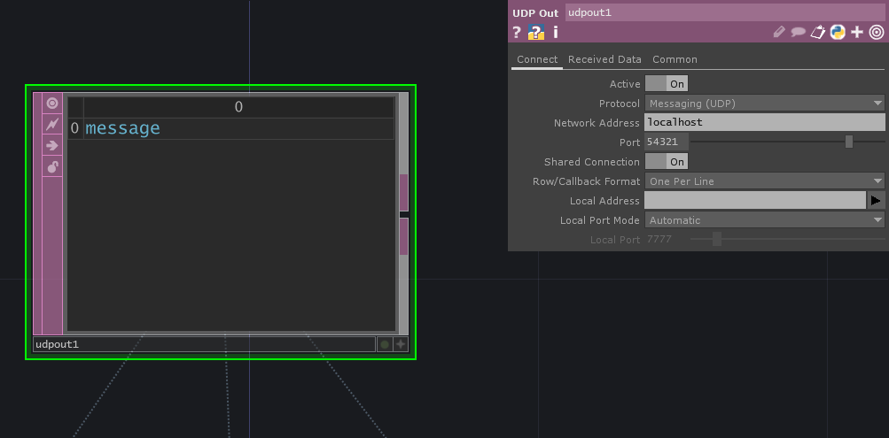
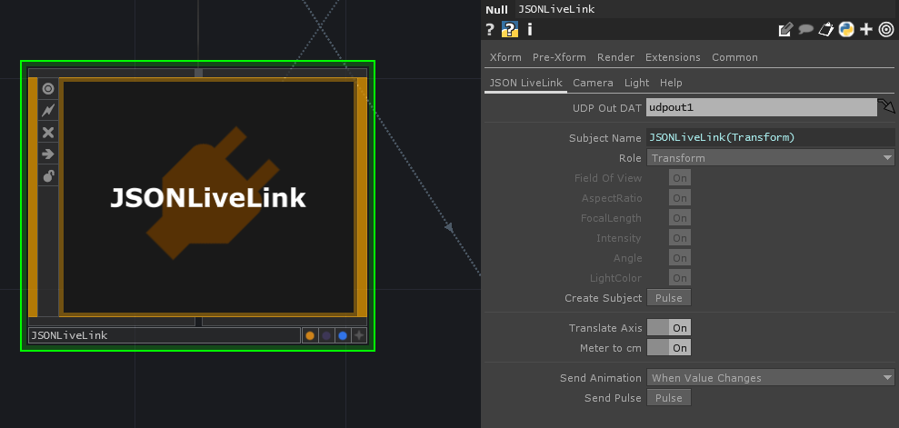
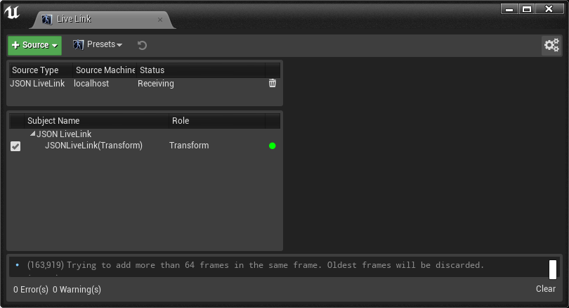

# TD-JSONLiveLink
TouchDesigner > JSONLiveLink > Unreal Engine

JSONLiveLinkEnhanced by [@clintonman](https://github.com/clintonman) : https://github.com/clintonman/JSONLiveLink/tree/enhanced

## Usage

[Instructional Video (TBD)]()

1. Install the JSONLiveLink plugin for Unreal.
     1. Create a new UE project, close the project.
     1. Create a `Plugins` folder in the project folder, and copy `JSONLiveLink`folder into it.
     1. Open the project, the project will be automatically rebuilt.
     1. Make sure the plugins `Live Link` and `JSONLiveLinkEnhanced` are enabled.
     
     1. Open the `Live Link` window (`Window > Live Link ) and add the JSONLiveLink source (specify the ip and port).
     
1. Drag and drop `JSONLiveLink.tox` into the TD.
1. Create a `UDP Out DAT` for it and specify it, and set the port parameter to be the same as the JSONLiveLink source on the UE side.
     
     
1. Confirm the type of `Role` you want to use and press `Create Subject`. The `Live Link` window on the UE side should show its subject.
     
1. The usage is consistent with any LiveLink plugin thereafter.

## Notes
- To control camera parameters in [UE 4.27](https://docs.unrealengine.com/4.27/en-US/WhatsNew/Builds/ReleaseNotes/4_27), the `LiveLinkCamera Plugin` needs to be enabled.

## Known Issues
- Scale doesn't work in UE 4.27.
- Once a Subject is created, the UE side cannot change the Role type anymore.
- If a Subject is deleted on the UE side, a topic with the same name cannot be created again.

>The above issues need to modify JSONLiveLink plugin itself to solve.
